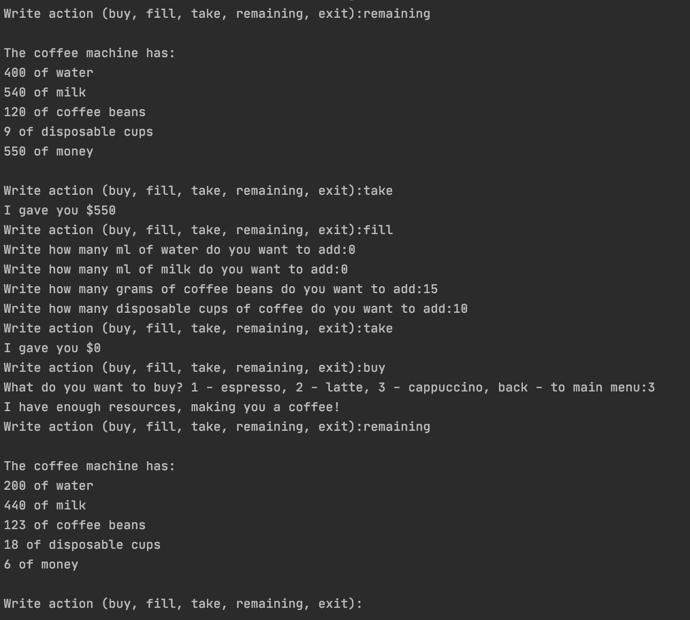

# Coffee machine simulator

## Starting
Clone repo or download zip
In terminal use `python3 coffee_machine.py`

## Actions
`buy` to order a coffee.
You can order a cup of: espresso, cappuccino or latte. Each of them requires resources to make coffee.

`fill` to fill the machine when resources ran out.

`take` to take money from the machine.

`remaining` to output amount of resources loaded.

`exit` to stop program.
or simply press `control+D` to stop it.

## Resources
Machine works with: `water, milk, coffee beans, cups and money`.

The machine initialized with `400ml of water, 540ml of milk, 120g of coffee beans, 9 cups, and 550$`.

This is my learning project at JetBrains academy.
https://hyperskill.org/projects/68
